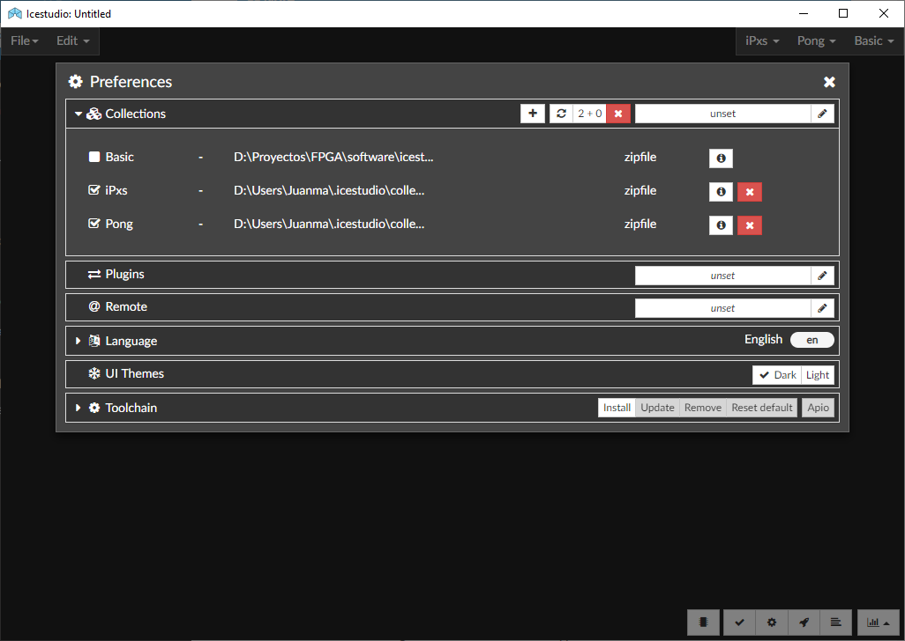

.. _collections:

Collections
===========

A collection is a directory containing multiple ICE projects. Projects are organized as **blocks** (to be added as sub-blocks in other projects) or **examples** (to use, analyze and learn). Projects in each group are sorted by categories (subdirectories).

Each collection MUST have a **package.json** file in the root, which contains information about the collection. An optional directory, **locale**, can contain translations. A collection has the following structure:

  .. code::

    Collection/
    ├── blocks/
    ├── examples/
    ├── locale/
    ├── LICENSE
    ├── package.json
    └── README.md

Unlike `FPGAwars/icestudio <https://github.com/FPGAwars/icestudio>`_, this variant of Icestudio allows to have multiple collections enabled at the same time. Menu **File > Collections** shows the list of available/installed collections (either built-in, internal or external). Examples, blocks and information about the collection can be opened from there.

Moreover, checkboxes allow to enable/disable each of collections. Enabled collections are shown on the top right corner, for easy instantiation of reusable blocks.

.. note:: Collection *Basic* is always available, and contains blocks and examples distributed with the application.

Managing collections
--------------------

Submenu **Edit > Preferences > Manage collections** allows to add/remove/reload internal or external collections.

+--------------+--------------------------------------------------------+
| Add (+)      | Add a zipfile with one or more collections.            |
+--------------+--------------------------------------------------------+
| Reload       | Reload all the collections from sources.               |
+--------------+--------------------------------------------------------+
| Add external | Set path to *external collections* dir in your system. |
+--------------+--------------------------------------------------------+
| Remove (x)   | Remove some or all the collections.                    |
+--------------+--------------------------------------------------------+
| Info (i)     | Show basic collection info *(Readme.md)*.              |
+--------------+--------------------------------------------------------+

Internal collections are those installed in ``~/.icestudio/collections``. Zipfiles are used for adding internal collections. A single zipfile can contain at least one or multiple *Collection directories* at the main level.

As a complement, the *external* path can be configured. It is the absolute path to a directory on the system, which is expected to contain additional collections or symbolic links to collections.

Basic
-----

Contains the basic blocks:

* **Input**:  Show a dialog to insert the name and type of the input block.
* **Output**:  Show a dialog to insert the name and type of the output block.
* **Constant**:  Show a dialog to insert the name and type of the constant block.
* **Memory**:  Show a dialog to insert the name and type of the memory block.
* **Code**:  Show a dialog to insert the ports and parameters of the code block.
* **Information**:  Create an empty text box block.

.. note:: **Input** and **Output** ports can be set to **virtual**. Virtual ports are used to independent-FPGA
  projects. Also, they can be configured as a **bus** by adding the notation ``[x:y]`` to the port name.

.. note:: **Constant** and **Memory** blocks can be set to **local**. Local parameters are not exposed when the project
  is added as a block.

.. hint:: Multiple **Input**, **Output**, **Constant** and **Memory** blocks can be created using the `comma` separator.
  For example: ``x, y, z`` will create 3 blocks with those names. FPGA I/O ports values are set in the block combo box.
  These values can be set by searching and also unset by doing click on the cross.

  Double clicking over **Input**, **Output**, **Constant** or **Memory** block allows to modify the block name and type.
  In **Code** block ports definition, multiple *input* and *output* ports, and *parameters*, can be created also using
  the `comma` separator.
