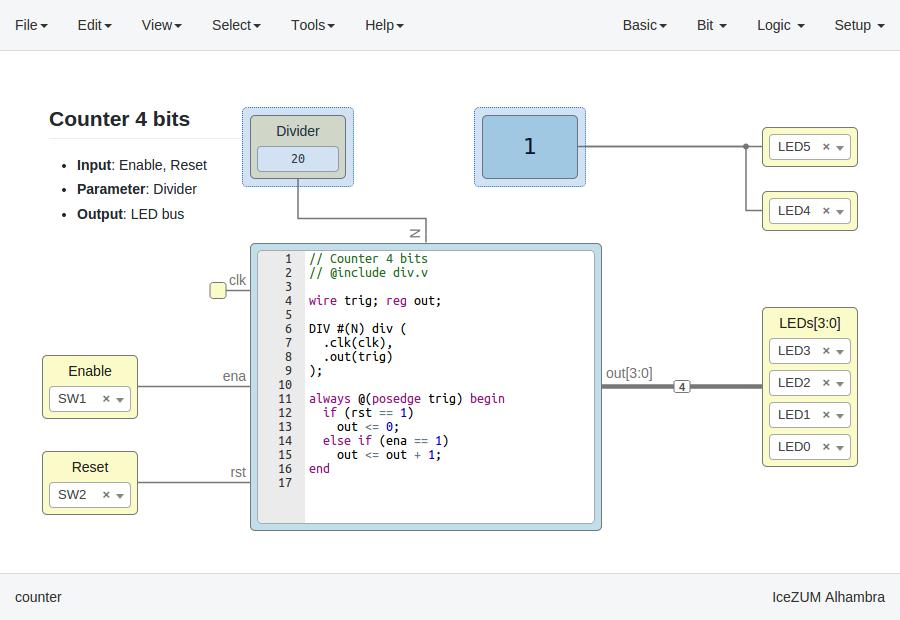
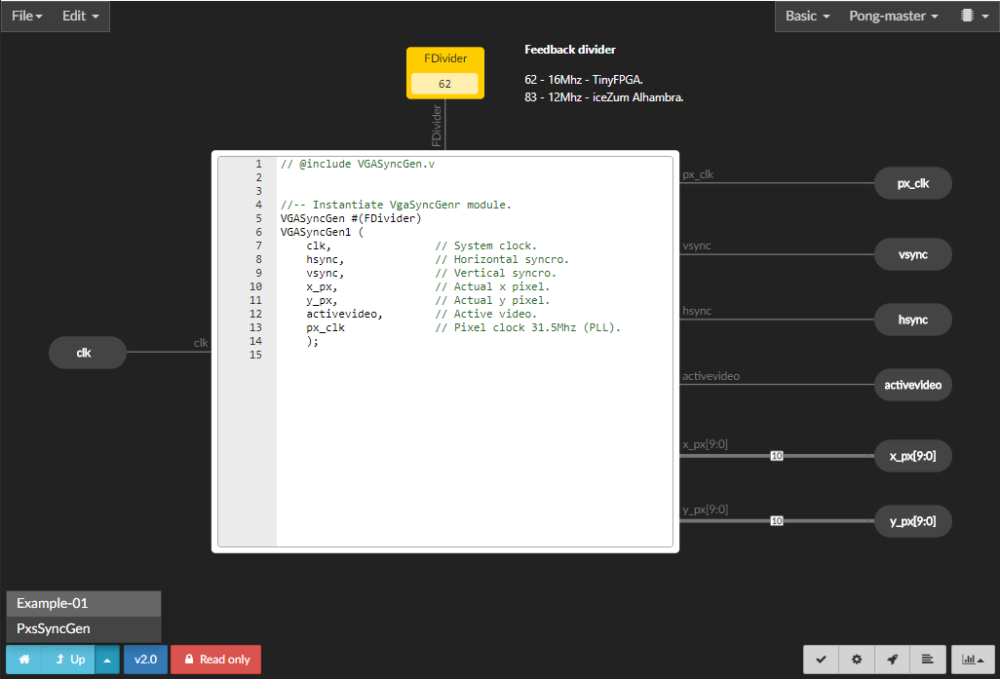
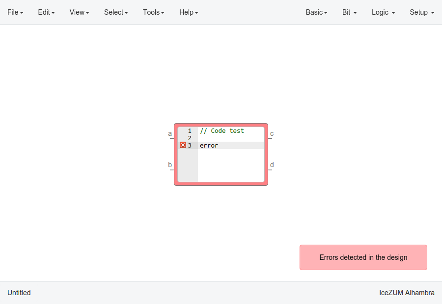
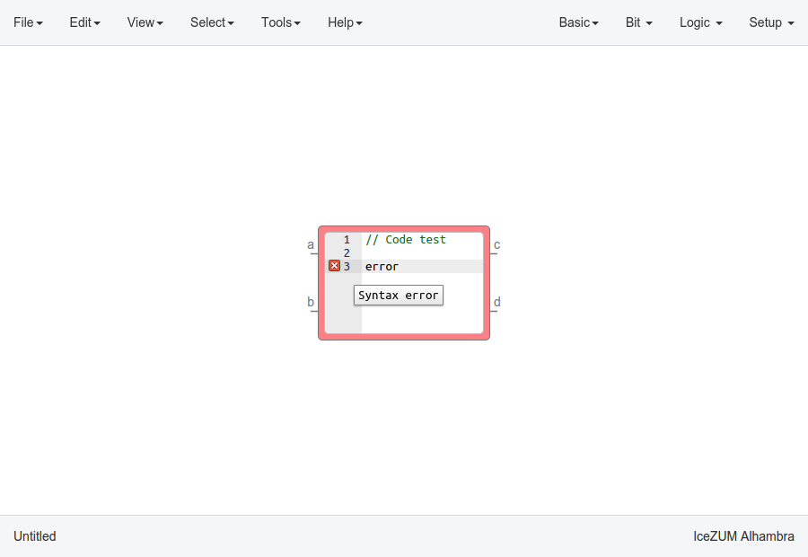
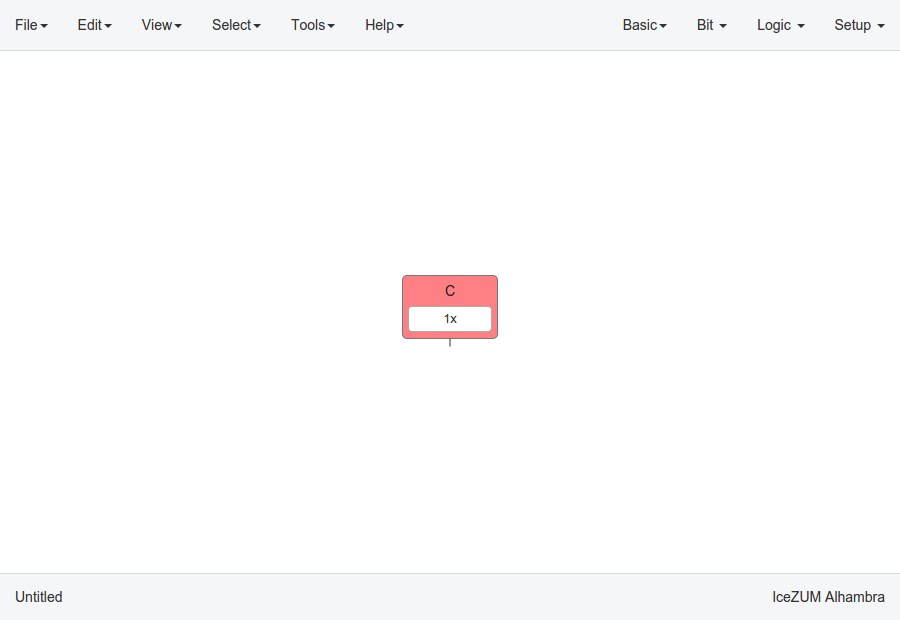
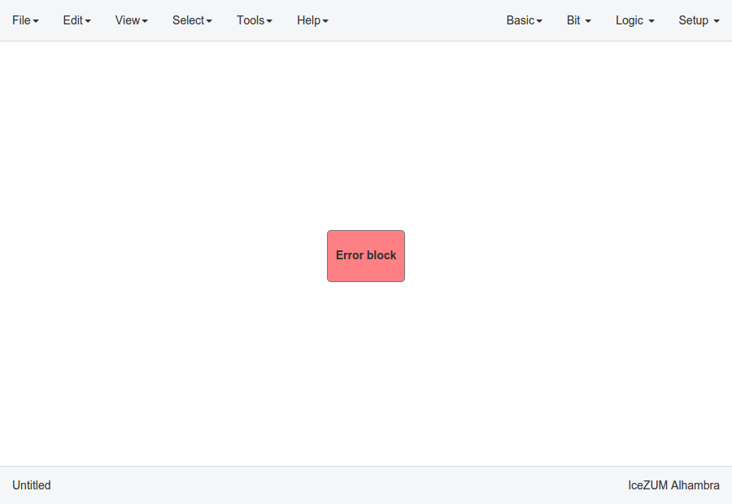

Design
------

Pan & Zoom
``````````

Pan is performed using the **Ctrl + mouse left button** or **mouse right button** over the background. Zoom is performed using **mouse wheel**.

Select
``````

Block selection is performed with the **mouse left button**. Blocks can be **selected/unselected** individually using **Shift+left-click**. In addition, several blocks can be selected by a **selection box**. A selection is canceled when the background is **left-clicked**.

.. image:: img/design_select.png
   :width: 400 px
   :align: center

Move blocks
```````````

Any block or blocks selection can be moved in the design using the **mouse left button** over the block or the selection. The selection can also be moved with the **arrow keys**.



Resize text blocks
``````````````````

**Memory**, **Code**, and **Information** blocks can be resized with the resize tool in the **bottom-right corner** of the block.

Block examination
`````````````````

Non-basic blocks can be examined by **double clicking** the block using the **mouse left button**. This is a recursive action. A navigation menu is shown on the bottom left corner, to easily jump back/up in the design. Pan, zoom and code browsing are enabled during navigation. *Edit > Fit content* is also supported. However, other menus are disabled.



Verilog error detection
```````````````````````
The Verify, Build and Upload errors are captured and showed in the design with a notification.



|

If the error comes from a Code block it is marked in red an inline annotation is set:



|

If the error comes from a Constant block it is marked in red.



If the error comes from a Generic block it is marked in red.



Undo/Redo
``````````

Icestudio allows to undo/redo the following actions:

* Add or remove a block.
* Add or remove a wire.
* Move a block or a blocks selection.
* Edit an I/O block: name, type and value.
* Edit a Constant block: name, type and value.
* Edit a Memory block: name, type, format and value.
* Edit a Code block: ports, parameters and content.
* Edit an Information block: type and content.
* Change the board.
* Change the language.
* Change the Project information: when undo/redo a Project information change, a clickable notification will appear to access the Project information section.
