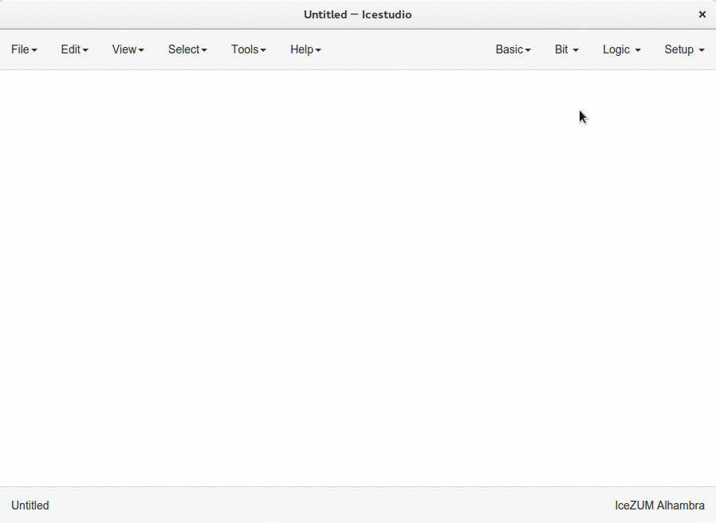
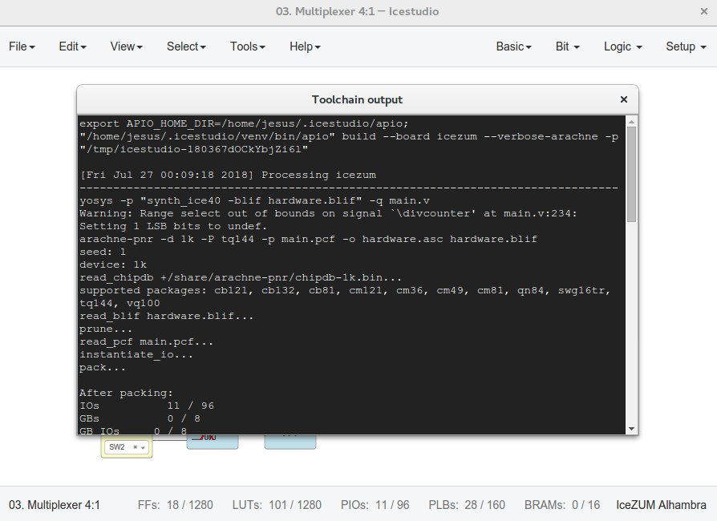
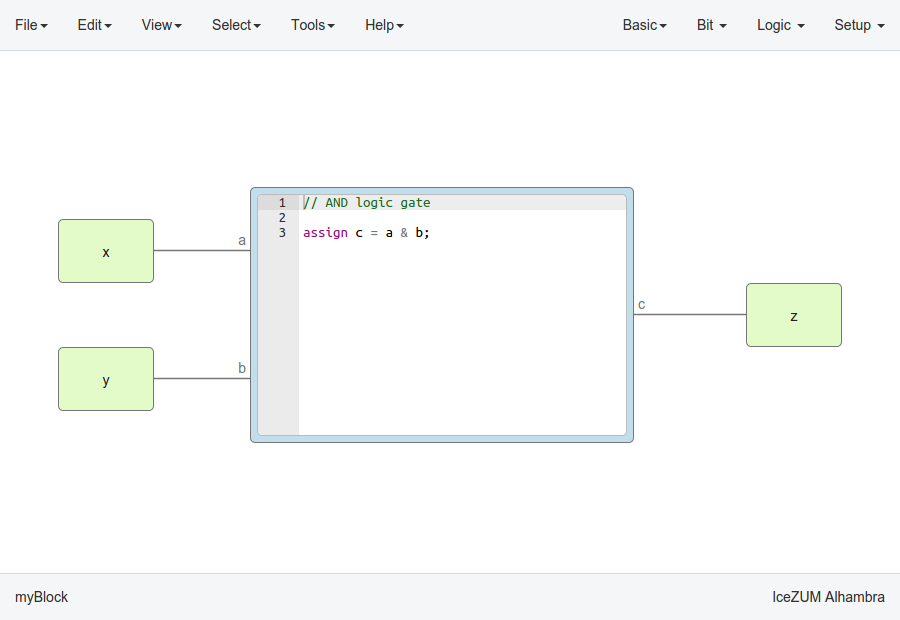

.. _howto:

How to...
=========

Take a snapshot
---------------

Taking a **png** snapshot of the application is as easy as press **Ctrl+P**. A save dialog appears to set the name and the path of the captured image.

Install the toolchain
---------------------

1. **Install Python ``>=3.6``**

2. **Launch the toolchain installation process**

  Go to **Edit > Preferences > Manage toolchain > Install**. Be patient for the toolchain installation.

  .. image:: img/howto_installtoolchain.png
     :width: 400 px
     :align: center

.. note:: When the toolchain is installed, the menu option changes to *Edit > Preferences > Manage toolchain > Update**. Also, the toolchain can be restored to default in **Edit > Preferences > Manage toolchain > Reset default**.

Update the toolchain
---------------------

1. **Connect to the Internet**

2. **Launch the toolchain updating process**

  Go to **Edit > Preferences > Manage toolchain > Update**. Be patient for the toolchain update.

Install the drivers
-------------------

1. **Install the toolchain** (required for Windows)

2. **Enable the FTDI drivers**

  Go to **Edit > Preferences > Drivers > Enable**. Each OS has a different process. This configuration requires administration privileges.

.. note::

    On Windows, an external application (`Zadig <https://zadig.akeo.ie/>`_) is used. It replaces the existing FTDI driver of the **Interface 0** with **libusbK**.

    .. image:: img/zadig.png
        :align: center
        :width: 400 px

    On macOS, this operation requires internet connection to allow *Homebrew* to install ``libffi`` and ``libftdi`` packages.

.. hint::

  For reverting the configuration, go to **Edit > Preferences > Drivers > Disable**.

Create a project
----------------

1. **Create a new project**

   Go to **Edit > New**. A new window will be opened.

   .. image:: img/howto_new.png
     :width: 400 px
     :align: center

2. **Add blocks**

There are different types of blocks:

 1. *Input/Output blocks*

    Click on **Basic > Input** or **Basic > Output**, write the block's name and press OK or Enter.

    Also, it can be configured as **buses** using the ``[x:y]`` notation (``x`` is the most significant bit).

    .. image:: img/howto_io-fpga.png
       :width: 400 px
       :align: center

    If these blocks are used to build generic blocks, they should be configured as **virtual** (green). Then, the FPGA pin selector won't be shown.

    .. image:: img/howto_io-virtual.png
       :width: 400 px
       :align: center

 2. *Constant blocks*

    Click on **Basic > Constant**, write the block's name and press OK or Enter.

    These blocks can be configures as **local**. Then, this parameter won't be exported.

    .. image:: img/howto_constant.png
       :width: 400 px
       :align: center

 3. *Memory blocks*

    Click on **Basic > Memory**, write the block's name and press OK or Enter.

    These blocks can be configures as **local**. Then, this parameter won't be exported. Also you can update the **address format** of the memory to be *binary*, *decimal* or *hexadecimal*.

    .. image:: img/howto_memory.png
       :width: 400 px
       :align: center

 4. *Code blocks*

    Click on **Basic > Code**, add the code ports. Port names are separated by a comma. E.g.: ``a, b``.

    .. image:: img/howto_code-prompt.png
       :width: 400 px
       :align: center

    This block contains a text editor to write your module in verilog code. Module header and footer are not required.

    .. image:: img/howto_code.png
       :width: 400 px
       :align: center

 5. *Info blocks*

    Click on **Basic > Info**.

    This block contains a text editor to add comments about the project in **Markdown** or **HTML**.

    .. image:: img/howto_info.png
       :width: 400 px
       :align: center

    It can be rendered simply by double-clicking the block.

    .. image:: img/howto_info-render.png
       :width: 400 px
       :align: center

 6. *Bit blocks*

    Click on **Bit > 0** or **Bit > 1**.

    These blocks are low and high logic drivers.

    .. image:: img/howto_bit.png
       :width: 400 px
       :align: center

 7. *Logic blocks*

    Go to the **Logic** menu and select a block. This menu contains **Gates**, **Combinational blocks** and **Sequential blocks**.

    .. image:: img/howto_logic.png
       :width: 400 px
       :align: center

 8. *Setup blocks*

    Click on **Setup > Pull up** or **Setup > Tri-state**.

    The *Pull up* block must be connected to input ports in order to configure a pull up in the FPGA.

    .. image:: img/howto_setup.png
       :width: 400 px
       :align: center

In this example we are going to implement an AND logic gate with its input/output pins connected to the FPGA I/O.

.. image:: img/howto_bwire.png
   :width: 400 px
   :align: center

3. **Connect the blocks**

.. image:: img/howto_wire.png
   :width: 400 px
   :align: center

4. **Select your board**

   Go to **Select > Board** and select the board from the list.

   .. image:: img/howto_board.png
     :width: 400 px
     :align: center

5. **Set FPGA I/O pins**

   Select all Input/Output blocks' pins.

   .. image:: img/howto_fpgapin.png
     :width: 400 px
     :align: center

6. **Save the project**

   Go to **Edit > Save as** and select the project name, for example *myProject*.

   It will be saved as an **.ice** file.

   .. image:: img/howto_saveas.png
     :width: 400 px
     :align: center

Upload a bitstream
------------------

1. **Open a project**

   Go to **Edit > Open...** and select an **.ice** file.

2. **Verify the project**

   Go to **Tools > Verify**.

   This option checks the generated verilog code using ``apio verify``.

   .. image:: img/howto_verify.png
      :width: 400 px
      :align: center

3. **Build the project**

   Go to **Tools > Build**.

   This option generates a bitstream using ``apio build``.

   .. image:: img/howto_build.png
      :width: 400 px
      :align: center

4. **Upload the project**

   Connect your FPGA board and press **Tools > Upload**. This option uses ``apio upload``.

   .. image:: img/howto_upload.png
      :width: 400 px
      :align: center

After executing *Tools > Verify*, *Tools > Build* or *Tools > Upload* you can see the executed command and the output in a new windows opened from **View > Command output**.

Create a block
--------------

1. **Open a project**

   Go to **Edit > Open project** and select an **.ice** file. It is recommended to set all the I/O ports non-FPGA ports (green) to create a block.

2. **Verify the project**

   Go to **Tools > Verify**.

2. **Add the project information**

   Go to **Edit > Preferences > Project information**.

   .. image:: img/project-info.png
      :width: 400 px
      :align: center

3. **Save the project**

   Go to **Edit > Save**.

   .. image:: img/howto_save.png
      :width: 400 px
      :align: center

Add a project as block
----------------------

1. **Open or create a new project**

2. **Import the custom block**

   Go to **Edit > Add as block...** and select an **.ice** file.

   .. image:: img/howto_addasblock.png
      :width: 400 px
      :align: center

   .. image:: img/howto_customblock.png
      :width: 400 px
      :align: center

3. **Examine the custom block**

   Complex blocks can be examined by double clicking the block.

   .. image:: img/howto_examine.png
      :width: 400 px
      :align: center

Create a collection package
---------------------------

1. **Create one or more collections**

You can use the `icm cli tool <https://github.com/FPGAwars/icm>`_ to create and update a collection.

 .. code::

   Collection/
   ├── blocks
   │   ├── category1
   │   │   ├── block1.ice
   │   │   └── subcategory1
   │   │       ├── block11.ice
   │   │       └── block12.ice
   │   └── category2
   │       └── block2.ice
   ├── examples
   │   ├── example1.ice
   │   ├── example2.ice
   │   └── example3.ice
   ├── locale
   │   ├── en
   │   │   └── en.po
   │   ├── es_ES
   │   │   └── es_ES.po
   │   └── translation.js
   ├── LICENSE
   ├── package.json
   └── README.md

2. **ZIP all your collections**

 Create a ZIP file with all your created collections at the main level.

 .. code::

   Collections.zip
   |
   ├── Collections 1
   │   └── ...
   └── Collections 2
       └── ...

.. note::

   The file **package.json** must exists, and also the **blocks** directory and/or the **examples** directory. The **locale** directory is optional. More information in the `Default collection <https://github.com/FPGAwars/collection-default>`_.

Include a list file
-------------------

If your code block contains a list file(s), for example:

.. code-block:: verilog

  $readmemh("rom.list", rom);

1. **Save the ice project**

2. **Copy the list file(s) to the project directory**

3. **Build and upload the project**

Also you can include explicitly a list file in the header of a code block:

.. code-block:: verilog

  // @include rom.list

Include a verilog (header) file
-------------------------------

If your code block includes a verilog (header) file(s), for example:

.. code-block:: verilog

  // @include lib.vh
  // @include math.v

  `include "lib.vh"

1. **Save the ice project**

2. **Copy the verilog (header) file(s) to the project's directory**

3. **Build and upload the project**

Configure a remote host
------------------------

I you want to use a RPi (or another computer), e.g. ``pi@192.168.0.22``, first configure the host:

1. **Copy your SSH public key into the server**

  .. code-block:: bash

    $ ssh-keygen
    $ ssh-copy-id -i .ssh/id_rsa.pub pi@192.168.0.22

2. **Install apio on the server**

  .. code-block:: bash

    $ ssh pi@192.168.0.22
    $ sudo pip install -U apio
    $ apio install --all
    $ apio drivers --enable  # For FTDI devices

3. **Enter the host name in Icestudio, Edit > Remote hostname**

   .. image:: img/howto_remotehost.png

4. **Now, Verify, Build and Upload tools will run on the selected host**
