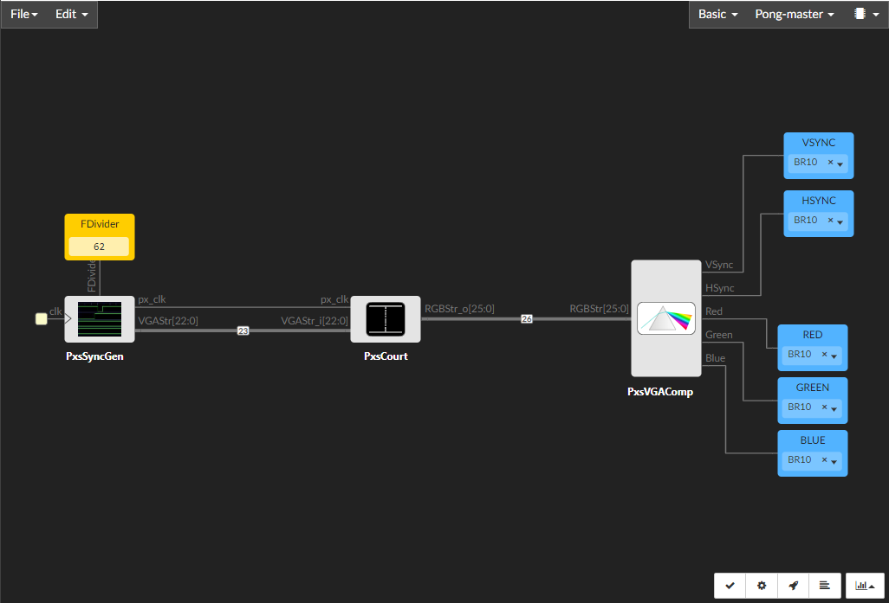

======================
Icestudio v1 (nightly)
======================

.. image:: resources/images/logo/icestudio-logo-label-nightly.png
   :width: 400 px
   :align: center
   :target: https://github.com/juanmard/icestudio

Icestudio is a visual editor for Verilog designs, built on top of `yosys <http://www.clifford.at/yosys/>`_, `nextpnr <https://github.com/YosysHQ/nextpnr>`_ and `icestorm <http://www.clifford.at/icestorm/>`_.

.. toctree::
    :maxdepth: 2
    :hidden:

    installation
    quickstart
    menu
    collections
    design
    board
    preferences
    howto

.. toctree::
    :caption: Development
    :maxdepth: 2
    :hidden:

    source/project
    source/blocks
    source/rules
    source/compiler
